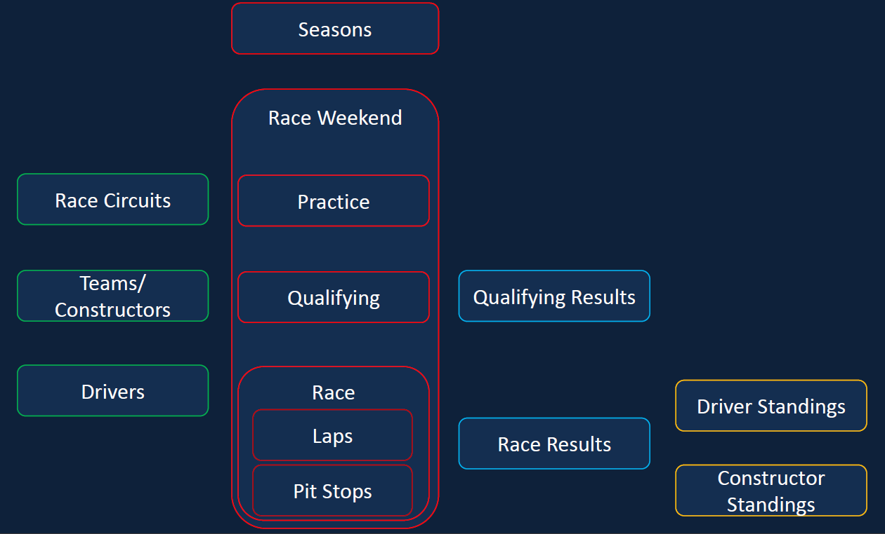
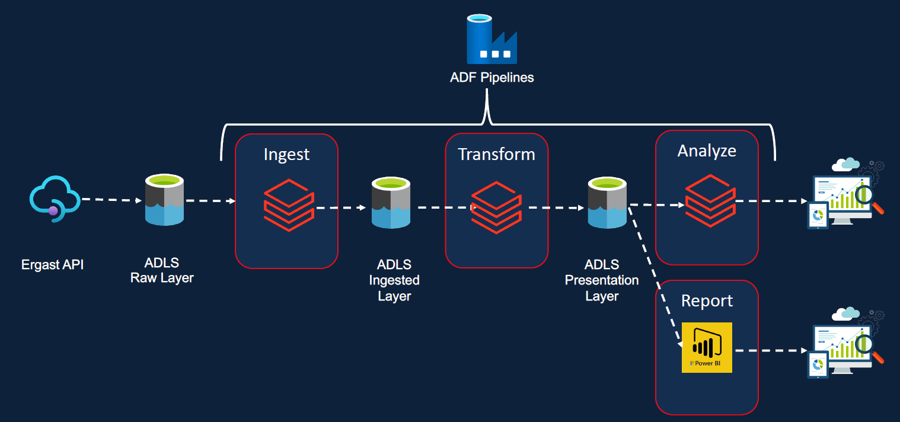
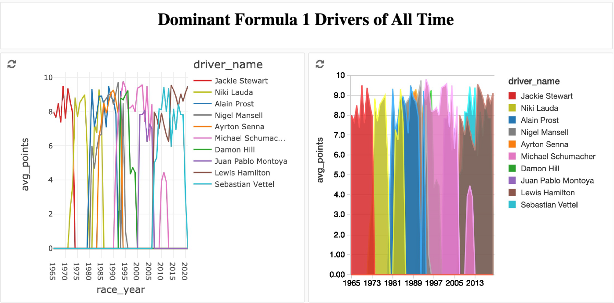
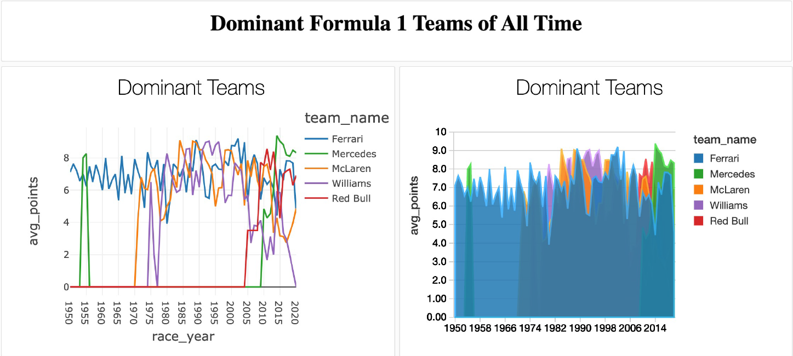

# Formula 1 Dataset Analysis Using Databricks

## Problem Statement
To perform analysis and visualization on Formula 1 race results.

### Formula 1 Overview
Details about Formula 1 racing can be learned from the following:   https://f1chronicle.com/a-beginners-guide-to-formula-1/

## Data Source
The data for all the formula 1 races from 1950s onwards is ontained from an open source API called Ergest Developer API (http://ergast.com/mrd/). The API provides the following tables:  

# Data Model

Attributes of each tables is described in http://ergast.com/docs/f1db_user_guide.txt. Each tables is present as a single line/multiline CSV or JSON file in the data folder. 

## Data Pipeline

The Ergest Developer API data is imported into an Azure Data Lake Storage (ADLS) container as raw data. We then utilize Databricks notebook to process and ingest this data into the ingested raw layer. The ingested data is structured with a schema and stored in columnar parquet format, with partitions created where applicable. Additionally, we include audit-related information such as date and data source. The transformed data is then processed through Databricks notebook for the presentation layer, where we create dashboards to fulfill our analysis requirements. Azure Data Factory is employed for scheduling and monitoring tasks. To meet GDPR and time travel requirements, the pipeline is later converted into the Delta Lakehouse architecture.

## Project Requirements
### Data Ingestion Requirements:
- Ingest All 8 files into the data lake.
- Ingested data must have audit columns.
- Ingested data must be stored in columnar format (i.e., Parquet).
- Ingested data must have the schema applied.
- Must be able to analyze the ingested data via SQL.
- Ingestion logic must be able to handle incremental load (Results, PitStopes, LapTimes, Qualifying).

### Data Transformation Requirements:
- Join the key information required for reporting to create a new table.
- Transformed tables must have audit columns.
- Transformed data must be stored in columnar format (i.e., Parquet).
- Must be able to analyze the transformed data via SQL.
- Transformation logic must be able to handle incremental load.

### Reporting Requirements:
- Drivers Standings.
- Constructors Standings.
  
### Analysis Requirements:
- Dominant Drivers.
- Dominant Teams.
- Visualize the outputs.
- Create Databricks Dashboards. 

### Scheduling Requirements:
- Scheduled to run every Sunday 10PM.
- Scheduling Requirements.
- Ability to monitor pipelines.
- Ability to re-run failed pipelines.
- Ability to set-up alerts on failures.

### Other Non-Functional Requirements:
- Ability to delete individual records.
- Other Non-Functional Requirements.
- Ability to see history and time travel.
- Ability to roll back to a previous version.

## Project Structure
1. ingestion - contains notebooks to ingest all the data files from raw layer to ingested layer. Handles the incremental data for files results, pitstopes, laptimes and qualifying.
2. trans - contains notebooks to transform the data from ingested layer to presentation layer. Notebook perfroms transformations to setup for analysis.
3. set-up - notebooks to mount ADLS storages (raw, ingested, presentaton) in databricks.
4. includes - includes notebooks containing helper functions used in transformations.
5. analysis - contains SQL files for finding the dominant drivers and teams and to prepare the results for visualization.
6. raw - contains SQL file to create ingested tables using Spark SQL.
7. utils - contains SQL file to drop all databases for incremental load.
8. data - contains sample raw data from ergast api.

## Results
### Dominant Divers

### Dominant Teams

## Technologies Used:
- Databricks
- Azure
- Azure Data Factory
- PySpark
- Python
- SQL

